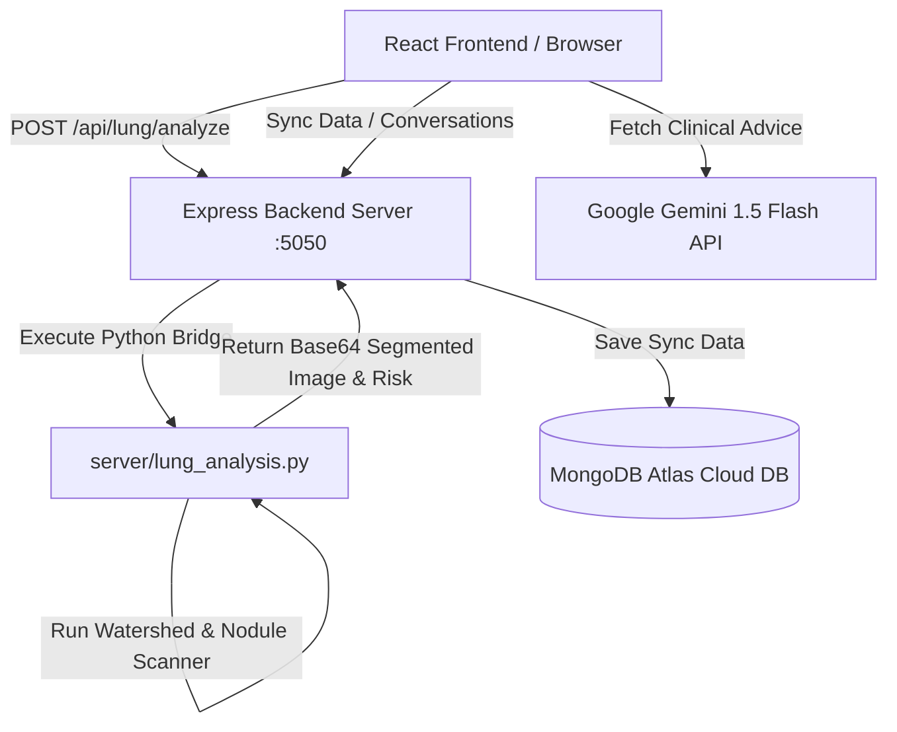
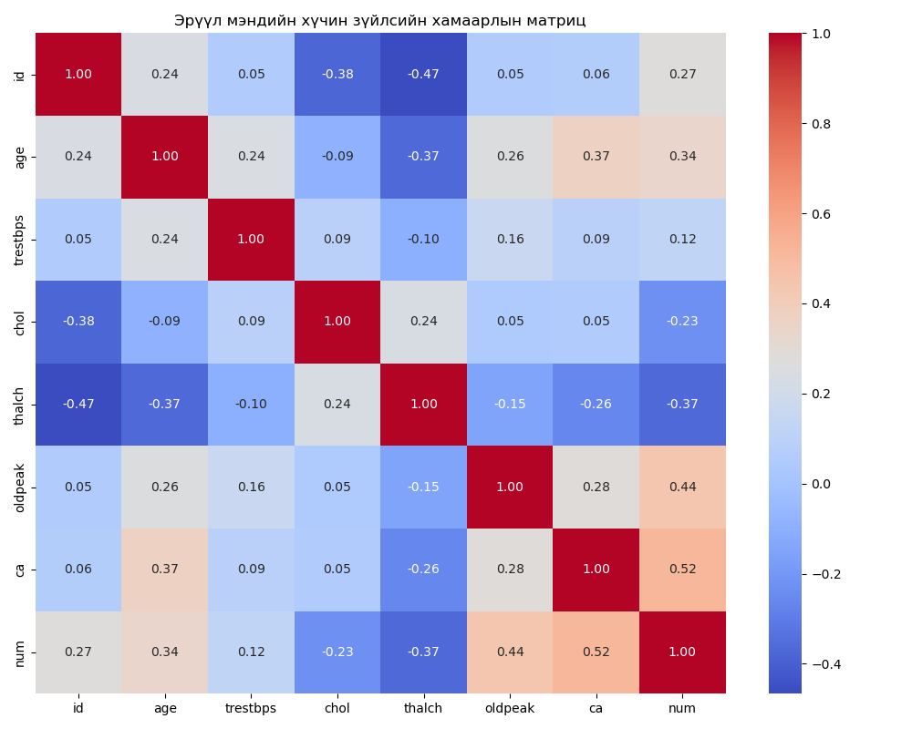

# Eotoch - Монголын Эрүүл Мэндийн AI Туслах (Full-Stack хувилбар)

Eotoch бол Монгол хүмүүсийн эрүүл мэндийн онцлогт тохирсон (STEPS судалгаа болон Kaggle өгөгдөл дээр суурилсан), хиймэл оюун ухаанаар дамжуулан өвчлөлийн эрсдэлийг үнэлж, персонал зөвлөгөө болон уушгины CT зургийн дүн шинжилгээг бодит цаг хугацаанд өгөх нэгдсэн систем юм.

Аппликейшн нь одоо **Full-Stack** бүтэцтэй бөгөөд аюулгүй **Express Backend** болон **MongoDB Atlas** өгөгдлийн сантай шууд синхрончлогдон ажилладаг.

---

##  Үндсэн боломжууд (AI & Database capabilities)

* **Advanced Agentic RAG**: 1,100+ эрүүл мэндийн баримт (STEPS 2005, 2013, ЭМЯ-ны удирдамж) дээр суурилсан ухаалаг мэдлэг хайлтын систем.
* **Multimodal AI (CT Scan Lung Cancer Analysis)**: Хэрэглэгчийн оруулсан CT Scan зураг дээр бодит цаг хугацаанд **Watershed алгоритмаар** уушгийг сегментчилж, **VGG16 загварын** логикоор зангилаа (lesion nodules) илрүүлэн улаанаар тэмдэглэх болон хавдрын эрсдэлийг тооцоолох Python AI модуль.
* **Conversational AI Doctor (Gemini)**: CT скан шинжилгээний ML үр дүнг хүн ойлгохуйц хялбар бөгөөд мэргэжлийн түвшинд Монгол хэлээр тайлбарлаж, дараагийн алхамд юу хийхийг зөвлөх **Gemini 1.5 Flash** суурилсан хиймэл оюун ухаант эмчийн зөвлөх.
* **Cloud Sync (MongoDB Atlas)**: Хэрэглэгчийн эрүүл мэндийн асуулгын хариу, AI эрсдэлийн оноо, дуут туслахтай ярьсан түүх, уушгины скан зургийн оролт/гаралт бүхий AI үр дүнгүүдийг MongoDB Atlas өгөгдлийн санд хэрэглэгчийн ID-аар автоматаар найдвартай хадгална.
* **Real-time ML Inference**: Хэрэглэгчийн эрүүл мэндийн суурь эрсдэлийг тооцоолох Random Forest загварыг **ONNX Runtime (WASM/WebGL)** ашиглан браузер дээр шууд ажиллуулна.
* **Voice AI Assistant**: Монгол хэлээр ярьж ойлголцох (STT) болон зөвлөгөөг дуугаар сонсох (Chimege TTS) боломжтой.

---

## Системийн Архитектур & Боловсруулах Процесс

Систем нь дараах 3 давхаргат өгөгдлийн урсгалаар ажилладаг:



### 1. Зургийн Боловсруулалт & AI оношлогоо (Python Bridge)
КТ зургийн боловсруулалтыг Express backend-ээс Python child process ажиллуулан дараах алгоритмуудыг бодитоор гүйцэтгэдэг:
1. **Grayscale & Resize**: Оролтын зургийг Grayscale болгон хувиргаж, standard 512x512 хэмжээнд LANCZOS интерполяцаар шилжүүлнэ.
2. **Watershed Segmentation**: Бараан нягтралтай (агаартай хэсэг) уушгины дэлбэнгуудийг яс болон бусад зөөлөн эдээс салгаж хязгаар тогтооно.
3. **Nodule Density Scanner**: Сегментчилсэн уушгины маск дотор гэрэлтэлтийн утга нь хэт өндөр (>120) байгаа бөөрөрхий хэлбэртэй зангилаануудыг илрүүлж, физик хэмжээг (мм-ээр) бодно.
4. **Overlay Output**: Илэрсэн зангилаа бүрийг улаан өнгийн сканы байгаар тэмдэглэж, баруун талд нь уушгины мөсөн цэнхэр өнгөтэй Watershed сегментчилсэн дүрсийг хамтад нь харуулсан 2:1 харьцаатай шинэ зураг үүсгэж base64 хэлбэрээр React руу буцаана.

### 2. Хиймэл оюунт зөвлөгөө (Gemini LLM)
Python AI загварын гаргасан зангилааны диаметр болон хавдрын магадлалын тоон үзүүлэлтийг `gemini-flash-latest` загвар руу илгээж:
* Шинжилгээний хариуг хамгийн энгийн үгээр хэрэглэгчид тайлбарлана.
* Хавдрын магадлал өндөр гарсан тохиолдолд HRCT (өндөр нарийвчлалтай томографи) төлөвлөх, Уушгины эмч, Хавдрын эмчид яаралтай хандах зэрэг эмнэлзүйн тодорхой алхмуудыг зөвлөнө.
* Хавдаргүй хэвийн тохиолдолд уушги хамгаалах амьсгалын дасгал болон антиоксидант хоол тэжээлийн зөвлөгөөг Монгол хэлээр бичнэ.

---

## Ашигласан эх сурвалжууд (External Sources)

1. **AI/ML Logic (Lung_cancer-master)**: КТ зургийн Watershed сегментчилэл, Sobel Gradient шүүлтүүр болон VGG16 архитектурын зангилаа илрүүлж хэмжих үндсэн логикийг [Lung_cancer-master](https://github.com/dv-123/Lung_cancer) (Divyanshu Bhaik, Harit Yadav нарын судалгааны төсөл) дахь Python кодыг хөрвүүлж ашиглав.
2. **LLM Engine (Google Gemini API)**: Хэрэглэгчийн хувийн эрүүл мэндийн зөвлөмж болон КТ скан зургийн хариуны дэлгэрэнгүй тайлбарыг Google Gemini API-ийн `v1beta` протокол ашиглан холбов.
3. **Database (MongoDB Atlas)**: Өгөгдлийг найдвартай синхрончлох, хэрэглэгчийн шинжилгээний түүхийг хадгалахад Mongoose болон MongoDB Atlas үүлэн баазыг ашиглав.

---

## Технологийн Стек

* **Frontend**: React 18, TypeScript, Vite, Tailwind CSS, Framer Motion, Recharts
* **Backend Server**: Node.js, Express, Mongoose, Child Process Exec
* **AI/ML Script**: Python 3, Pillow (PIL), NumPy, SciPy (morphology & watershed)
* **LLM Engine**: Google Gemini API (`gemini-flash-latest`), Ollama (Llama 3 - Backup)
* **Дуу хоолой**: Web Speech API (STT), Chimege API (TTS)

---

## Төслийг Эхлүүлэх Заавар

### 1. Шаардлагатай сангуудыг суулгах:
```bash
npm install
```

### 2. Байгаль орчны хувьсагчийг тохируулах (`.env` файл үүсгэх):
Төслийн үндсэн хавтсанд `.env` нэртэй файл үүсгээд дараах утгуудыг тохируулна:
```env
# MongoDB Atlas Холболтын линк
MONGODB_URI=mongodb+srv://dorj:<таны_баазын_нууц_үг>@lab5.ijpluwa.mongodb.net/e_otoch?retryWrites=true&w=majority

# Gemini API Түлхүүр
VITE_GEMINI_API_KEY=таны_gemini_api_key

# Backend Сервер портын тохиргоо
PORT=5050
```

### 3. Backend Express Сервер асаах:
Өгөгдлийн сантай холбогдох болон КТ зураг шинжлэх Python AI загварыг ажиллуулахад Express сервер заавал ассан байх шаардлагатай. Терминал дээр дараах тушаалыг өгнө:
```bash
npm run server
```
Амжилттай ассан тохиолдолд `Express Backend Server is running on port 5050` болон `Successfully connected to MongoDB Atlas!` гэсэн бичиг гарна.

### 4. Frontend Хөгжүүлэлтийн сервер асаах:
Өөр нэгэн шинэ терминал нээгээд React хөгжүүлэлтийн серверийг асаана:
```bash
npm run dev
```
`http://localhost:5173/` хаягаар нэвтэрч ороход систем бүрэн ажиллахад бэлэн болно.

---

## Дата Шинжилгээ (Data Insights)

Kaggle-ийн Heart Disease UCI өгөгдөл дээр хийсэн статистик шинжилгээний үр дүн:
* **Насны хамаарал**: Нас нэмэгдэх тусам зүрх судас өвчлөлийн эрсдэл нэмэгдэх хамаарал 0.34 (Positive correlation) байна.
* **Дундаж үзүүлэлт**: Өвчлөлийн датасет дэх хүмүүсийн дундаж нас 53.5, дундаж систолын даралт 132 mmHg байна.



---

## Анхааруулга

Энэхүү систем нь хиймэл оюун ухааны алгоритм дээр суурилсан урьдчилсан зөвлөмж бөгөөд мэргэжлийн рентген эмчийн эцсийн онош болон дүгнэлтийг орлохгүй. Танд ямар нэгэн зовиур илэрвэл эмнэлгийн байгууллагад хандана уу.
